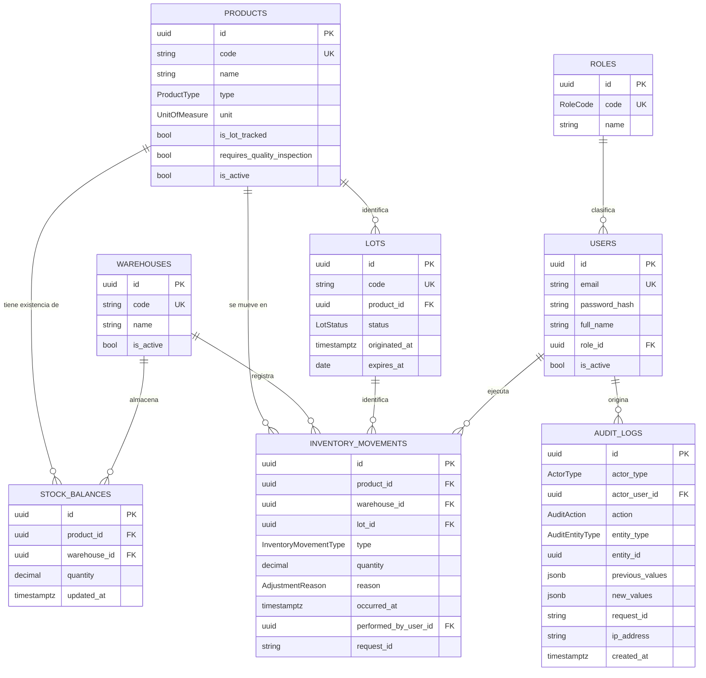
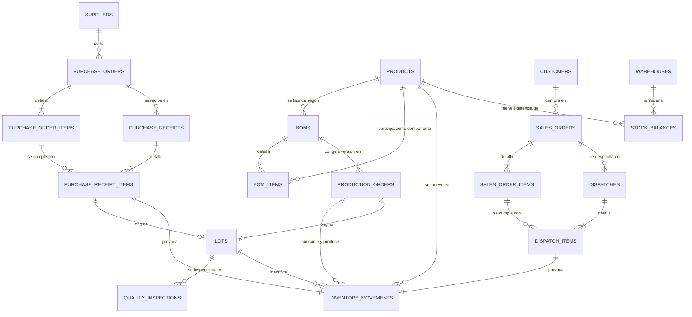

# Base de datos — EcoSoap ERP

> **Estado:** Foundation implementada y verificada contra PostgreSQL 16 temporal el 2026-09-23.
> La conformidad académica sigue pendiente de cotejo con Entrega 1. El contenedor previsto de
> PostgreSQL 18 no estuvo disponible en esta sesión.

## 1. Alcance

Define el **modelo conceptual completo** de los cuatro dominios, aunque su implementación física
sea incremental. `InventoryMovement` es el punto donde convergen Compras, Producción y Ventas:
diseñarlo conociendo un solo dominio obligaría a rehacerlo al llegar el siguiente.

Decisiones que lo sostienen:

- [ADR 004 — Ledger de inventario y balance materializado](decisions/004-inventario-ledger-y-balance.md)
- [ADR 005 — Estrategia de auditoría](decisions/005-estrategia-de-auditoria.md)
- [ADR 006 — Estrategia de identificadores](decisions/006-estrategia-de-identificadores.md)
- [ADR 007 — Trazabilidad de lotes](decisions/007-trazabilidad-de-lotes.md)

## 2. Convenciones

| Aspecto              | Convención                                                               |
| -------------------- | ------------------------------------------------------------------------ |
| Clave primaria       | `String @id @default(uuid(7)) @db.Uuid`                                  |
| Código humano        | Columna `code` o `number` aparte, única e indexada, nunca clave primaria |
| Nombres de tabla     | `snake_case` en plural mediante `@@map`                                  |
| Nombres de columna   | `snake_case` mediante `@map`                                             |
| Instantes            | `DateTime @db.Timestamptz(6)`, almacenados en UTC                        |
| Fechas de calendario | `DateTime @db.Date`, sin hora ni zona                                    |
| Cantidades           | `Decimal @db.Decimal(18, 4)`                                             |
| Precios unitarios    | `Decimal @db.Decimal(14, 4)`                                             |
| Importes             | `Decimal @db.Decimal(14, 2)`                                             |
| Borrado              | Lógico con `isActive`; nunca físico si hay histórico                     |
| Snapshots            | `Json @db.JsonB`                                                         |

**`snake_case`.** PostgreSQL pliega a minúsculas los identificadores sin comillas, de modo que
`SELECT * FROM InventoryMovement` falla. Como el equipo inspeccionará la base con `psql` y pgAdmin,
`snake_case` evita tener que entrecomillar en cada consulta.

### Instantes frente a fechas de calendario

No son el mismo tipo de dato y mezclarlos causa errores en el cambio de día.

| Campo                                       | Tipo          | Razón                                        |
| ------------------------------------------- | ------------- | -------------------------------------------- |
| `occurredAt`, `createdAt`, `updatedAt`      | `timestamptz` | Momentos exactos en la línea del tiempo      |
| `receivedAt`, `dispatchedAt`, `inspectedAt` | `timestamptz` | Momentos exactos                             |
| `startedAt`, `completedAt`, `originatedAt`  | `timestamptz` | Momentos exactos                             |
| `ProductionOrder.plannedDate`               | `date`        | La planificación es por día, no por instante |
| `PurchaseOrder.expectedDate`                | `date`        | La fecha esperada de entrega es un día       |
| `Lot.expiresAt`                             | `date`        | El vencimiento es un día, no una hora        |

### Zona horaria empresarial

Los instantes se guardan en UTC. Pero dos cosas necesitan una **zona empresarial explícita**
porque dependen del calendario local:

- El **año** usado por los códigos correlativos (`OC-2026-000001`).
- La interpretación de las fechas de calendario introducidas por el usuario.

La zona empresarial es **`America/Managua`** (UTC−6, sin horario de verano). Sin fijarla, dos
usuarios operando cerca de medianoche del 31 de diciembre obtendrían años distintos.

### Redondeo monetario

`lineTotal = round(quantity × unitPrice, 2)`. Los totales del documento suman importes de línea ya
redondeados, de modo que lo mostrado y lo almacenado coinciden. Una sola moneda; no hay tabla de
divisas.

## 3. Enums

### Fundación

```text
RoleCode              ADMIN · COMPRAS · INVENTARIO · PRODUCCION · VENTAS
ProductType           RAW_MATERIAL · INTERMEDIATE · FINISHED_GOOD · CONSUMABLE
UnitOfMeasure         UNIT · GRAM · KILOGRAM · MILLILITER · LITER
LotStatus             QUARANTINED · RELEASED · REJECTED
InventoryMovementType ADJUSTMENT_IN · ADJUSTMENT_OUT
AdjustmentReason      INITIAL_LOAD · PHYSICAL_COUNT · DAMAGE · LOSS · EXPIRY · CORRECTION
ActorType             USER · SYSTEM · ANONYMOUS
AuditAction           CREATE · UPDATE · DELETE · ENABLE · DISABLE
                      LOGIN · LOGIN_FAILED · LOGOUT · ADJUST_STOCK
AuditEntityType       USER · ROLE · PRODUCT · WAREHOUSE · LOT · INVENTORY_MOVEMENT
DocumentType          LOT
```

`AdjustmentReason` no incluye `OTHER`: un motivo genérico vacía de sentido la obligación de dar un
motivo. Si aparece un caso real que no encaje, se amplía el enum.

Aprobar y rechazar calidad tendrán acciones propias (`QUALITY_APPROVE`, `QUALITY_REJECT`) en la
migración de Producción, en lugar de reutilizar `CONFIRM` y `CANCEL`.

### Por dominio

```text
PurchaseOrderStatus   DRAFT · CONFIRMED · PARTIALLY_RECEIVED · RECEIVED · CANCELLED
ProductionOrderStatus DRAFT · CONFIRMED · IN_PROGRESS · COMPLETED · CANCELLED
SalesOrderStatus      DRAFT · CONFIRMED · PARTIALLY_DISPATCHED · DISPATCHED · CANCELLED
QualityStatus         PENDING · APPROVED · REJECTED
```

`AuditEntityType`, `AuditAction`, `InventoryMovementType` y `DocumentType` se amplían solo cuando la
migración de dominio incorpore las entidades o acciones correspondientes. Los códigos humanos de
los tipos futuros se documentan en §12, pero no son operables en Foundation.

## 4. Modelo de la fundación



`DocumentSequence` no aparece en el diagrama porque no tiene relaciones: es infraestructura
(`documentType`, `year`, `lastNumber`, único por `(documentType, year)`).

### Notas por entidad

**`Product`** gana `requiresQualityInspection`. Decide si sus lotes nacen en cuarentena. Sin esta
bandera habría que elegir entre obligar a inspeccionar cada recepción de materia prima o no poder
bloquear nunca un lote.

**`Lot.originatedAt`** sustituye a `producedAt`. Es el instante en que el lote pasó a existir:
la finalización de la producción o la recepción de la mercancía. Un campo llamado «producido» que
además significara «recibido» haría ambiguas todas las consultas.

**`InventoryMovement.reason`** es obligatorio en los ajustes y nulo en el resto. Una nota libre no
basta como justificación: un motivo tipificado se puede filtrar, contar y auditar.

## 5. Matriz tipo → origen por migración

Este es el punto que la auditoría marcó como P0. Un movimiento no puede apuntar por clave foránea
a una tabla que todavía no existe, y tampoco se admite `sourceType + sourceId` sin clave foránea,
porque renunciaría a la integridad referencial.

La solución es que **cada migración declare qué tipos acepta y cuál es su origen obligatorio**, y
reemplace la restricción `CHECK` anterior por la ampliada.

| Migración    | Tipos permitidos                                 | Origen obligatorio            | Columna añadida            |
| ------------ | ------------------------------------------------ | ----------------------------- | -------------------------- |
| 1 Fundación  | `ADJUSTMENT_IN`, `ADJUSTMENT_OUT`                | ninguno; `reason` obligatorio | —                          |
| 2 Compras    | \+ `PURCHASE_RECEIPT`                            | `purchaseReceiptItemId`       | `purchase_receipt_item_id` |
| 3 Producción | \+ `PRODUCTION_CONSUMPTION`, `PRODUCTION_OUTPUT` | `productionOrderId`           | `production_order_id`      |
| 4 Ventas     | \+ `SALE_DISPATCH`                               | `dispatchItemId`              | `dispatch_item_id`         |

La restricción de la fundación es, literalmente:

```sql
CHECK (
  type IN ('ADJUSTMENT_IN', 'ADJUSTMENT_OUT')
  AND reason IS NOT NULL
)
```

**La fundación no puede registrar recepciones, consumos ni despachos.** No es una limitación: es
la garantía de que ningún movimiento pueda existir sin un origen empresarial verificable. La
migración 2 sustituye la restricción por:

```sql
CHECK (
  (type IN ('ADJUSTMENT_IN','ADJUSTMENT_OUT')
     AND reason IS NOT NULL
     AND purchase_receipt_item_id IS NULL)
  OR
  (type = 'PURCHASE_RECEIPT'
     AND reason IS NULL
     AND purchase_receipt_item_id IS NOT NULL)
)
```

y así sucesivamente. Cada migración amplía tanto el enum como la restricción, y nunca deja un tipo
habilitado cuyo origen no pueda comprobarse.

## 6. Invariantes de integridad

### Producto del lote y del movimiento

`InventoryMovement.productId` debe coincidir con `Lot.productId` cuando hay lote. Esto **no** se
deja a la validación de backend: se garantiza con una **clave foránea compuesta**, verificada como
viable en Prisma 7.

```prisma
model Lot {
  id        String @id @default(uuid(7)) @db.Uuid
  productId String @map("product_id") @db.Uuid
  @@unique([id, productId])      // habilita la referencia compuesta
}

model InventoryMovement {
  productId String  @map("product_id") @db.Uuid
  lotId     String? @map("lot_id") @db.Uuid
  lot       Lot?    @relation(fields: [lotId, productId], references: [id, productId])
}
```

PostgreSQL rechaza entonces cualquier movimiento cuyo lote pertenezca a otro producto. La misma
técnica se aplica en las migraciones siguientes a `PurchaseReceiptItem` ↔ `PurchaseOrderItem` y a
`DispatchItem` ↔ `SalesOrderItem`, para que la línea cumplida y la ordenada no puedan referirse a
productos distintos.

### Coherencia con `isLotTracked`

- Si `Product.isLotTracked` es verdadero, todo movimiento de ese producto debe llevar `lotId`.
- Si es falso, `lotId` debe ser nulo.

Una restricción `CHECK` **no puede consultar otra tabla**, de modo que esta regla vive en el
servicio de inventario y en sus pruebas. Es una limitación real de PostgreSQL, no una elección.

### Cambio de `isLotTracked`

**Prohibido** mientras el producto tenga movimientos o existencia distinta de cero. Activar la
bandera dejaría existencias previas sin lote atribuible; desactivarla rompería cadenas de
trazabilidad ya construidas.

Cambiarla exige un procedimiento explícito, documentado y auditado: llevar la existencia a cero
mediante ajustes justificados, cambiar la bandera y volver a cargar el inventario con lotes. No
hay atajo, y el backend rechaza el cambio directo.

### Origen único del lote

| Tipo de lote           | Origen                | Se añade en |
| ---------------------- | --------------------- | ----------- |
| Materia prima          | `PurchaseReceiptItem` | Migración 2 |
| Intermedio y terminado | `ProductionOrder`     | Migración 3 |

Desde la migración 2, un `CHECK` de arco exclusivo exige que todo lote tenga exactamente un
origen. **No deben existir lotes trazables operativos sin origen empresarial identificable.**

Consecuencia que conviene tener presente: **durante la fundación no debe crearse ningún lote
operativo**, porque todavía no existe ningún documento que pueda originarlo. Los únicos
movimientos posibles son ajustes, y en la fundación solo deben aplicarse a productos sin
trazabilidad. La carga inicial de inventario con lotes se hace cuando exista Compras.

## 7. Política de calidad y liberación de lotes

> **Requisito propuesto, no oficial.** No consta en el documento académico disponible. Queda
> registrado como `RF-PRO-010` en [`requirements.md`](requirements.md) marcado como propuesto,
> pendiente de cotejo con la Entrega 1.

```text
Lote creado
    ↓
requiresQualityInspection = false  →  RELEASED
requiresQualityInspection = true   →  QUARANTINED
                                          ↓
                                   QualityInspection
                                    ↓            ↓
                              APPROVED      REJECTED
                                    ↓            ↓
                               RELEASED      REJECTED
```

| Estado        | Despacho  | Consumo en producción | Ajuste de salida |
| ------------- | --------- | --------------------- | ---------------- |
| `QUARANTINED` | Bloqueado | Bloqueado             | Permitido        |
| `RELEASED`    | Permitido | Permitido             | Permitido        |
| `REJECTED`    | Bloqueado | Bloqueado             | Permitido        |

**El consumo también se bloquea, no solo el despacho.** La auditoría preguntaba expresamente si
debía hacerse. Debe: fabricar jabón con aceite rechazado contamina un lote de producto terminado
que después habría que retirar del mercado. Bloquear únicamente el despacho protege al cliente
pero no al proceso, que es donde el daño se multiplica.

El ajuste de salida permanece permitido en todos los estados porque es precisamente la vía para
dar de baja material rechazado.

Un lote puede tener varias inspecciones si se permite reinspección. **El estado vigente del lote
es `Lot.status`**, no el resultado de la última inspección: la inspección propone, el servicio de
calidad aplica el cambio dentro de una transacción. Así no hay dos fuentes de verdad.

## 8. Protocolo transaccional de inventario

Todo cambio de existencias sigue este protocolo, sin excepciones:

```text
BEGIN
  1. validar la operación empresarial y los estados implicados
  2. obtener o crear la fila de StockBalance del par (producto, almacén)
  3. bloquear esa fila            SELECT ... FOR UPDATE
  4. validar la existencia general
  5. validar la existencia y el estado del lote, cuando aplique
  6. crear InventoryMovement
  7. actualizar StockBalance
  8. actualizar el documento empresarial
  9. crear AuditLog
COMMIT
```

### Creación de la primera fila

El paso 2 tiene una condición de carrera propia: dos operaciones simultáneas sobre un producto sin
balance previo intentarían insertar la misma fila. Se resuelve con un `upsert` atómico sobre
`(product_id, warehouse_id)`, protegido por su índice único, seguido del `SELECT ... FOR UPDATE`.
Nunca con «comprobar si existe y luego insertar», que es exactamente la carrera que se quiere
evitar. La prueba concurrente de Foundation verifica esta ruta.

### Orden estable de bloqueo

Una operación que toca varios productos —completar una producción consume varios componentes—
debe bloquear sus filas **en un orden determinista** para no provocar interbloqueos.

El orden es: **ascendente por `product_id`, y a igualdad, por `warehouse_id`**. Dos operaciones
concurrentes que compitan por los mismos productos los tomarán en la misma secuencia, de modo que
una espera a la otra en lugar de bloquearse mutuamente.

### Disponibilidad por lote

Se calcula sumando los movimientos del lote **dentro del mismo bloqueo** del paso 3. Como todos
los movimientos del par `(producto, almacén)` se serializan sobre esa fila, el resultado es
consistente sin necesidad de una tabla `LotBalance`.

## 9. Reconciliación

La invariante del sistema debe poder comprobarse en cualquier momento:

```sql
SELECT sb.product_id,
       sb.warehouse_id,
       sb.quantity                      AS balance,
       COALESCE(SUM(im.quantity), 0)    AS ledger,
       sb.quantity - COALESCE(SUM(im.quantity), 0) AS diferencia
FROM stock_balances sb
LEFT JOIN inventory_movements im
       ON im.product_id  = sb.product_id
      AND im.warehouse_id = sb.warehouse_id
GROUP BY sb.product_id, sb.warehouse_id, sb.quantity
HAVING sb.quantity <> COALESCE(SUM(im.quantity), 0);
```

Un resultado vacío significa que balance y ledger concuerdan. La consulta forma parte de las
pruebas de integridad. **No se implementa todavía como tarea automática**: la ejecuta el equipo y
la ejecutan las pruebas.

## 10. Modelo conceptual completo



### Compras — migración 2

| Entidad               | Papel       | Campos relevantes                                                                            |
| --------------------- | ----------- | -------------------------------------------------------------------------------------------- |
| `Supplier`            | Raíz        | `code` UK, `name`, `taxId?`, `email?`, `phone?`, `address?`, `isActive`                      |
| `PurchaseOrder`       | Raíz        | `number` UK, `supplierId`, `status`, `orderedAt`, `expectedDate?` (date), `createdByUserId`  |
| `PurchaseOrderItem`   | Dependiente | `purchaseOrderId`, `productId`, `quantityOrdered`, `unitPrice`, `lineTotal`                  |
| `PurchaseReceipt`     | Raíz        | `number` UK, `purchaseOrderId`, `receivedAt`, `receivedByUserId`, `notes?`                   |
| `PurchaseReceiptItem` | Dependiente | `purchaseReceiptId`, `purchaseOrderItemId`, `productId`, `warehouseId`, `lotId?`, `quantity` |

**`quantityReceived` no se almacena.** Es la suma de las líneas de recepción de esa línea de
orden, y almacenarla crearía un tercer dato derivado que puede desincronizarse. Se deriva; si el
rendimiento algún día lo exigiera, materializarla requeriría las mismas garantías transaccionales
que `StockBalance` y quedaría registrado en un ADR.

Una línea de recepción representa una combinación concreta de producto, almacén y, cuando aplica,
lote. Repartir una entrega entre dos lotes exige dos líneas y produce dos movimientos.

### Producción — migración 3

| Entidad             | Papel       | Campos relevantes                                                                                                                                                        |
| ------------------- | ----------- | ------------------------------------------------------------------------------------------------------------------------------------------------------------------------ |
| `Bom`               | Raíz        | `productId`, `version`, `quantityBase`, `isActive`, `notes?` — único `(productId, version)`                                                                              |
| `BomItem`           | Dependiente | `bomId`, `componentProductId`, `quantity`                                                                                                                                |
| `ProductionOrder`   | Raíz        | `number` UK, `productId`, `bomId`, `warehouseId`, `quantityPlanned`, `quantityProduced`, `plannedDate` (date), `status`, `startedAt?`, `completedAt?`, `createdByUserId` |
| `QualityInspection` | Raíz        | `lotId`, `status`, `observations?`, `inspectedAt`, `inspectedByUserId`                                                                                                   |

**`BomItem` no tiene columna de unidad.** La cantidad se expresa en la unidad base del componente,
que ya está en `Product.unit`. Una unidad propia implicaría conversiones que el proyecto declara
inexistentes, y una conversión implícita y no implementada es peor que ninguna.

**`plannedDate` es fecha de calendario**, no instante: la producción se planifica por día. Cubre
`RF-PRO-003`, que el modelo anterior omitía.

**Congelación de la versión de BOM.** `ProductionOrder.bomId` apunta a la versión exacta usada.
Una `Bom` referenciada por alguna orden **no puede modificarse**: las correcciones crean una
versión nueva y desactivan la anterior. La regla vive en el backend porque exige consultar otra
tabla, y tiene prueba propia. Sin ella, editar una fórmula reescribiría la historia de lo que
realmente se fabricó.

### Ventas — migración 4

| Entidad          | Papel       | Campos relevantes                                                                  |
| ---------------- | ----------- | ---------------------------------------------------------------------------------- |
| `Customer`       | Raíz        | `code` UK, `name`, `taxId?`, `email?`, `phone?`, `address?`, `isActive`            |
| `SalesOrder`     | Raíz        | `number` UK, `customerId`, `status`, `orderedAt`, `createdByUserId`                |
| `SalesOrderItem` | Dependiente | `salesOrderId`, `productId`, `quantityOrdered`, `unitPrice`, `lineTotal`           |
| `Dispatch`       | Raíz        | `number` UK, `salesOrderId`, `dispatchedAt`, `dispatchedByUserId`, `notes?`        |
| `DispatchItem`   | Dependiente | `dispatchId`, `salesOrderItemId`, `productId`, `warehouseId`, `lotId?`, `quantity` |

`quantityDispatched` tampoco se almacena, por la misma razón que `quantityReceived`.

### Confirmar una venta no reserva inventario

En esta versión **no existen reservas**. La consecuencia debe quedar explícita porque afecta a lo
que `CONFIRMED` significa:

```text
CONFIRM SALES ORDER
  → comprueba disponibilidad de forma INFORMATIVA
  → no bloquea, no reserva, no garantiza nada

DISPATCH
  → vuelve a comprobar
  → bloquea StockBalance
  → valida el lote y su estado
  → genera el movimiento
```

La disponibilidad solo queda determinada al despachar. Una orden confirmada puede quedarse sin
existencia si otra operación la consume antes. Implementar reservas sería un requisito nuevo.

## 11. Integridad

### Unicidad

```text
roles.code · users.email · products.code · warehouses.code · lots.code
suppliers.code · customers.code
purchase_orders.number · purchase_receipts.number
production_orders.number · sales_orders.number · dispatches.number
stock_balances (product_id, warehouse_id)
boms (product_id, version)
document_sequences (document_type, year)
lots (id, product_id)          -- habilita la clave foránea compuesta
```

### Restricciones `CHECK`

Prisma no modela `CHECK`; se añaden como SQL dentro de la migración correspondiente.

| Tabla                  | Restricción                                                                                    |
| ---------------------- | ---------------------------------------------------------------------------------------------- |
| `stock_balances`       | `quantity >= 0`                                                                                |
| `inventory_movements`  | `quantity <> 0`                                                                                |
| `inventory_movements`  | el signo de `quantity` concuerda con `type`                                                    |
| `inventory_movements`  | matriz tipo → origen de la migración vigente (§5)                                              |
| `audit_logs`           | `entity_type` y `entity_id` nulos o presentes a la vez                                         |
| `audit_logs`           | solo `LOGIN_FAILED` puede omitir la entidad                                                    |
| `audit_logs`           | `actor_type = USER` exige `actor_user_id`; `SYSTEM` y `ANONYMOUS` lo prohíben                  |
| `audit_logs`           | `LOGIN_FAILED` siempre anónimo; `LOGIN` identifica al usuario autenticado como actor y entidad |
| `lots`                 | desde la migración 2: exactamente un origen empresarial                                        |
| `purchase_order_items` | `quantity_ordered > 0`                                                                         |
| `sales_order_items`    | `quantity_ordered > 0`                                                                         |
| `bom_items`            | `quantity > 0`                                                                                 |
| `production_orders`    | `quantity_planned > 0`                                                                         |

### Reglas que `CHECK` no puede expresar

Una restricción `CHECK` no puede consultar otra tabla. Estas reglas viven en el servicio y tienen
prueba propia:

- Coherencia entre `Product.isLotTracked` y la presencia de `lotId`.
- Bloqueo de consumo y despacho según `Lot.status`.
- Prohibición de cambiar `isLotTracked` con movimientos existentes.
- Inmutabilidad de una `Bom` ya usada por una orden.
- Tope de cantidad recibida o despachada frente a la ordenada.

### Disparadores

`inventory_movements` y `audit_logs` rechazan `UPDATE` y `DELETE`. Además, la cuenta de aplicación
no debe tener permiso de `TRUNCATE` sobre ellas.

> **Probado en PostgreSQL 16 temporal:** la migración se aplicó desde cero; una segunda ejecución
> de `migrate dev` no reportó drift, y las pruebas SQL rechazaron cambios al ledger y a auditoría.
> Falta repetir en el contenedor PostgreSQL 18 del proyecto.

### Borrado

Todas las claves foráneas usan `onDelete: Restrict`. Los datos maestros se desactivan con
`isActive`; los usuarios referenciados por movimientos, documentos y auditoría sobreviven siempre
a su desactivación.

### Índices

```text
products (type) · products (is_active)
lots (product_id) · lots (status)
inventory_movements (product_id, occurred_at)
inventory_movements (lot_id, warehouse_id)
inventory_movements (warehouse_id, occurred_at)
inventory_movements (request_id)
audit_logs (entity_type, entity_id, created_at)
audit_logs (actor_user_id, created_at)
audit_logs (created_at) · audit_logs (request_id)
purchase_orders (supplier_id, status) · sales_orders (customer_id, status)
production_orders (status) · production_orders (planned_date)
```

Las columnas `code` y `number` obtienen su índice de la restricción de unicidad. Se añadirán
índices compuestos adicionales cuando existan consultas concretas que los justifiquen, no antes.

## 12. Numeración de documentos

`DocumentSequence` mantiene un contador por `(documentType, year)`. El año se determina con la
**zona empresarial `America/Managua`**, no con UTC.

Formatos, en español para mantener coherencia con el idioma del proyecto:

```text
OC-2026-000001    orden de compra
REC-2026-000001   recepción
OP-2026-000001    orden de producción
OV-2026-000001    orden de venta
DES-2026-000001   despacho
LOT-2026-000001   lote
```

Reglas de la numeración:

- **Los huecos son válidos y esperados.** No se promete numeración consecutiva sin saltos.
- **Un número publicado o cancelado jamás se recicla.** Un documento cancelado conserva el suyo.
- El número se asigna dentro de la transacción que crea el documento, bloqueando la fila del
  contador.
- **El número no se muestra al usuario como definitivo hasta el commit.** Enseñar un número antes
  de confirmar induce a apuntarlo y luego no encontrarlo.

No se usan secuencias de PostgreSQL porque administrar una por cada combinación de tipo y año es
más engorroso que una tabla pequeña, y porque `nextval` tampoco evita los huecos.

## 13. Semilla inicial

Repetible e idempotente, identificando las filas por su código estable:

- Los cinco roles: `ADMIN`, `COMPRAS`, `INVENTARIO`, `PRODUCCION`, `VENTAS`.
- Un almacén por defecto: `ALM-PRINCIPAL`.

**Sin usuario administrador.** Crear uno exige una política de credenciales que corresponde a la
etapa de autenticación. El alta segura del primer administrador debe definirse antes de activarla.

## 14. Plan de migraciones

| #   | Nombre                | Contenido                                                                                                                                                                            |
| --- | --------------------- | ------------------------------------------------------------------------------------------------------------------------------------------------------------------------------------ |
| 1   | `database_foundation` | `Role`, `User`, `Product`, `Warehouse`, `Lot`, `StockBalance`, `InventoryMovement`, `AuditLog`, `DocumentSequence`, enums de fundación, `CHECK` de ajustes, disparadores append-only |
| 2   | `purchases`           | Entidades de Compras; origen del lote de materia prima; amplía enum y `CHECK` de origen                                                                                              |
| 3   | `production`          | `Bom`, `BomItem`, `ProductionOrder`, `QualityInspection`; origen del lote de salida                                                                                                  |
| 4   | `sales`               | `Customer`, `SalesOrder`, `SalesOrderItem`, `Dispatch`, `DispatchItem`                                                                                                               |

Cada migración debe ser **autoconsistente**: sus restricciones deben ser válidas por sí solas y
no dejar relaciones huérfanas ni tipos habilitados sin origen verificable.

## 15. Riesgos

| Riesgo                                                       | Mitigación                                                                         | Estado            |
| ------------------------------------------------------------ | ---------------------------------------------------------------------------------- | ----------------- |
| `StockBalance` desincronizado del ledger                     | Servicio único, disparadores, consulta de reconciliación en pruebas                | Mitigado          |
| `CHECK` y disparadores frente a Prisma Migrate y base sombra | Migración desde cero y segunda ejecución sin drift en PostgreSQL 16; repetir en 18 | **Probado en 16** |
| `ALTER TYPE ... ADD VALUE` en migraciones posteriores        | Se comprobará en la migración 2, la primera que lo hará                            | **Sin probar**    |
| Interbloqueos con varios productos                           | Orden estable de bloqueo por `product_id`, luego `warehouse_id` (§8)               | Mitigado          |
| Carrera al crear la primera fila de balance                  | `INSERT ... ON CONFLICT DO NOTHING` seguido de `SELECT ... FOR UPDATE`             | Mitigado          |
| `Decimal` operado como número de JavaScript                  | Regla explícita y prueba que la verifique                                          | Mitigado          |
| Snapshots de auditoría con datos sensibles                   | Lista **permitida** de campos por entidad, no lista prohibida                      | Mitigado          |
| Un administrador de base puede alterar el disparador         | Aceptado: ninguna garantía de la aplicación protege frente a superusuario          | Aceptado          |
| Cotejo con el documento académico oficial                    | Pendiente de recibir la Entrega 1                                                  | **Abierto**       |

## 16. Conexión local

```text
DATABASE_URL=postgresql://ecosoap:<password>@localhost:5433/ecosoap_erp?schema=public
```

El contenedor expone PostgreSQL en el puerto 5433 para no chocar con instalaciones nativas. Ver
[`setup.md`](setup.md), sección 4.
